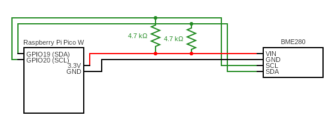

# Raspberry Pi Pico W BM280 WIFI MQTT
## About the project
This project is my part of an IoT system built during my internship where I've implement the following key functions:

* Reading temperature, moisture and pressure from the BME280.
* Sending data from a Raspberry Pi Pico W to a Mosquitto MQTT broker.
* Re-connect logic for both WiFi and MQTT.

## Functionality
The standard setting of this system is aimed towards indoor readings. The BME280 driver is set with a high sensitivity for temperature and humidity, while a lower sensitivity for changes in airpressure. This is to avoid sudden spikes like opening a window or closing doors.

The system is connected to a Mosquitto MQTT broker via WIFI. Within the set intervals it reads the temperature from the BME280, converts the data and then parses it to a JSON string. After that it publishes the data to a predetermined topic.

If the system is unable to connect WiFi, it will panic - stop execution. The same goes for the MQTT broker connection. If the unit looses it's connection it will try to re-connect first to WIFI and then to the MQTT broker. If any of these attempts fail, the unit will restart itself and re-initialize.

## Pre-requisites
The following are required to be able to run this:

### 1. BME280 driver submodule
If you have already cloned this project and forgot to include the bme280 driver, you can fix this using this command:

`git submodule update --init --recursive`

### 2. Raspberry Pi Pico W SDK
This is needed for all includes regarding the I2C. You can find a guide on how to install it here:

[https://datasheets.raspberrypi.com/pico/getting-started-with-pico.pdf](<https://datasheets.raspberrypi.com/pico/getting-started-with-pico.pdf>)

### 3. GCC
Compiler for C code.

**For windows**  
[Guide for windows](https://medium.com/@anazilthottunghal/a-guide-to-installing-gcc-on-windows-5cc95c2f38c4)

**For Mac**  
`brew install gcc`

**For Linux**  
`sudo apt-get install gcc`

### 4. Cmake
This is the build tool for the project and routinely used for raspberry pi pico projects.

[You can download it here](https://cmake.org/download/)

### 5. Correctly connected system
This is an example of how connected mine:



### 6. MQTT broker
You will need a broker to connect to. If you are missing this, you can use my repository here: https://github.com/lafftale1999/Mosquitto_MQTT_Docker

## Configurations

**pico_credentials.h**  
Create this .h file in include/ and update the following settings:

```c
#ifndef PICO_CREDENTIALS_H
#define PICO_CREDENTIALS_H

#define DEVICE_MODEL "PICO_W"

#define MQTT_USERNAME "pico_w"
#define MQTT_PASSWORD "pico123"

#define WIFI_SSID "Your-network"
#define WIFI_PASS "your-password123"

#endif
```

**pico_mqtt.h**
```c
#define MQTT_SERVER         "192.168.61.111"
#define MQTT_TLS_PORT       8883
#define MQTT_PORT           8883
```

**lwipopts.h**
```c
#define MQTT_CERT_INC 1     // Setting this to 0 will disable TLS
```

**main.c**
```c
#define WIFI_POLLING_MS 100
#define DEVICE_POLLING_MS 5000
#define MQTT_PUBLISH_MS 20000
#define BLINK_INTERVAL_MS 1000
#define MQTT_TOPIC "/room_meas"
```

## Building
To succesfully build this project you need to do the following:

**1. Clone this project**  
To properly clone this project run the following command:

`git clone --recurse-submodules https://github.com/lafftale1999/raspberry_pi_pico_temp_sensor_reader.git`

If you already cloned the project, but forgot to include the submodule you can run this command:

`git submodule update --init --recursive`

**2. Convert Certificates**  
Add `ca.crt`, `client.crt` and `client.key` to `certs/`. Make sure that `client.crt` and the MQTT brokers certificate are signed by the same `ca.crt`. Make sure that the names are correct.

Then navigate to `scripts/` and run the following command:  
    `chmod +x convert_certs.sh`  
    `./convert_certs.sh`

**3. Build**  
Navigate to the root of the project and run the following commands:

`mkdir build`

`cmake -B build -G Ninja -S .`

`cmake --build build`

## Author
I'm currently studying to become an embedded engineer. At the moment I'm focused on learning more about IoT specific protocols and improving my skills in reading datasheets and converting them into code.